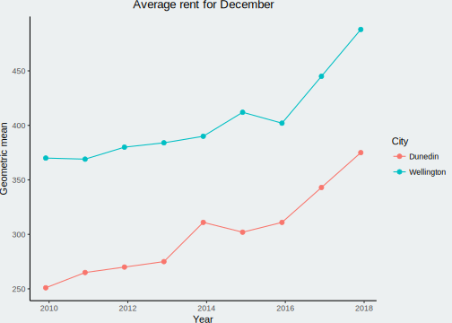

Are landlords cashing in on student loan changes ?

### Background

The government [recently announced](https://www.studylink.govt.nz/about-studylink/news/2017/increases-to-student-allowance-and-living-costs.html) that student allowance and living costs are increasing by $50/pw. There has since been a lot of media coverage suggesting landlords are capitalising on this by increasing rent by the same amount. I will look at tenency bond data from the Ministry of Business, Innovation, and Employment (MBIE) to see if a rent increase is supported by bond data.

### The details

The announcement was made late November so at the moment we only the December data should be effected. December should also have a higher proportion of students signing on for flats relative to the rest of the population (although January data would be helpful).

In the graph below we can see the average[^1] rent for dwellings in Wellington and Dunedin (I figured these are the most _studenty_ places). We would expect rent for tenency bonds lodged in December to increase sharply in 2017. However, the data suggests rent is increasing at the same rate from as realy as 2016 (at least a year before the announcement).

[^1]: The average was caluclated using the [geometric mean](https://en.wikipedia.org/wiki/Geometric_mean), it's basically a mean that is less sensitive to outliers.

 
If we look more closely at the numbers we can support that between the last two Decembers rent in Wellington increased by $43 (9.7%). Yet in the period before that we see a similar $43 (10.7%) increase. I have also compared the lower quartiles which show a similar trend, making it unlikely that lower rent student flats are not being effected. Do note though, that this is only lodged bonds and any changes in rent to people continuing their tenancy will not be captured. Although I'm assuming it's less of a problem for students who are more likely to take up a new tenency each year.

<table class="table table-striped table-hover" style="width: auto !important; margin-left: auto; margin-right: auto;">
<thead><tr>
<th style="text-align:left;">  </th>
   <th style="text-align:right;"> Average(\$) </th>
   <th style="text-align:right;"> Change(\$) </th>
   <th style="text-align:right;"> Percent change (%) </th>
  </tr></thead>
<tbody>
<tr grouplength="5"><td colspan="4" style="border-bottom: 1px solid;"><strong>Wellington</strong></td></tr>
<tr>
<td style="text-align:left; padding-left: 2em;" indentlevel="1"> 2013-12-01 </td>
   <td style="text-align:right;"> 390 </td>
   <td style="text-align:right;"> NA </td>
   <td style="text-align:right;"> NA </td>
  </tr>
<tr>
<td style="text-align:left; padding-left: 2em;" indentlevel="1"> 2014-12-01 </td>
   <td style="text-align:right;"> 412 </td>
   <td style="text-align:right;"> 22 </td>
   <td style="text-align:right;"> 5.6 </td>
  </tr>
<tr>
<td style="text-align:left; padding-left: 2em;" indentlevel="1"> 2015-12-01 </td>
   <td style="text-align:right;"> 402 </td>
   <td style="text-align:right;"> -10 </td>
   <td style="text-align:right;"> -2.4 </td>
  </tr>
<tr>
<td style="text-align:left; padding-left: 2em;" indentlevel="1"> 2016-12-01 </td>
   <td style="text-align:right;"> 445 </td>
   <td style="text-align:right;"> 43 </td>
   <td style="text-align:right;"> 10.7 </td>
  </tr>
<tr>
<td style="text-align:left; padding-left: 2em;" indentlevel="1"> 2017-12-01 </td>
   <td style="text-align:right;"> 488 </td>
   <td style="text-align:right;"> 43 </td>
   <td style="text-align:right;"> 9.7 </td>
  </tr>
<tr grouplength="5"><td colspan="4" style="border-bottom: 1px solid;"><strong>Dunedin</strong></td></tr>
<tr>
<td style="text-align:left; padding-left: 2em;" indentLevel="1"> 2013-12-01 </td>
   <td style="text-align:right;"> 311 </td>
   <td style="text-align:right;"> NA </td>
   <td style="text-align:right;"> NA </td>
  </tr>
<tr>
<td style="text-align:left; padding-left: 2em;" indentLevel="1"> 2014-12-01 </td>
   <td style="text-align:right;"> 302 </td>
   <td style="text-align:right;"> -9 </td>
   <td style="text-align:right;"> -2.9 </td>
  </tr>
<tr>
<td style="text-align:left; padding-left: 2em;" indentLevel="1"> 2015-12-01 </td>
   <td style="text-align:right;"> 311 </td>
   <td style="text-align:right;"> 9 </td>
   <td style="text-align:right;"> 3.0 </td>
  </tr>
<tr>
<td style="text-align:left; padding-left: 2em;" indentLevel="1"> 2016-12-01 </td>
   <td style="text-align:right;"> 343 </td>
   <td style="text-align:right;"> 32 </td>
   <td style="text-align:right;"> 10.3 </td>
  </tr>
<tr>
<td style="text-align:left; padding-left: 2em;" indentLevel="1"> 2017-12-01 </td>
   <td style="text-align:right;"> 375 </td>
   <td style="text-align:right;"> 32 </td>
   <td style="text-align:right;"> 9.3 </td>
  </tr>
</tbody>
</table>

### Conclusion

Rent in December has increased by the same amount in the last two years, providing little evidence of an increase due to a change in living costs or student allowance. Some landlords and property managers may have increased rent, but it doesn't seem to have an observable effect so far. Hopefully we will get a clearer idea in January when I also hope to do more robust significance testing.